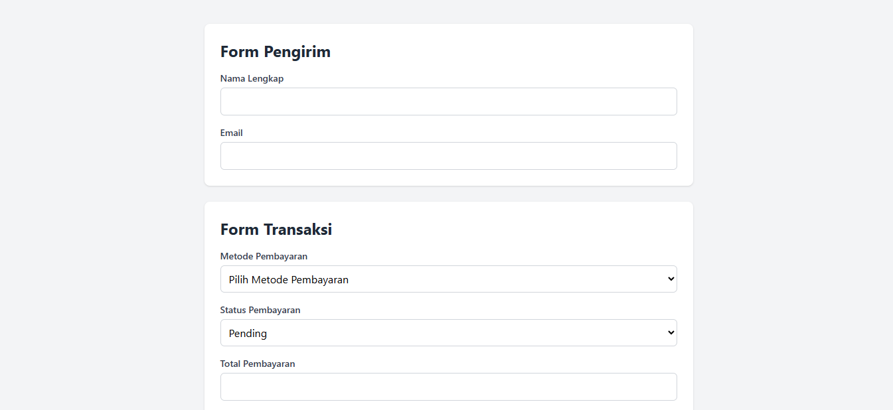
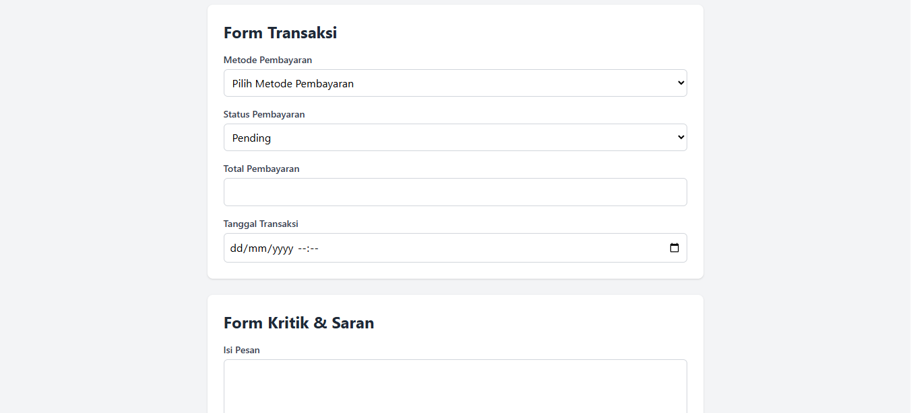
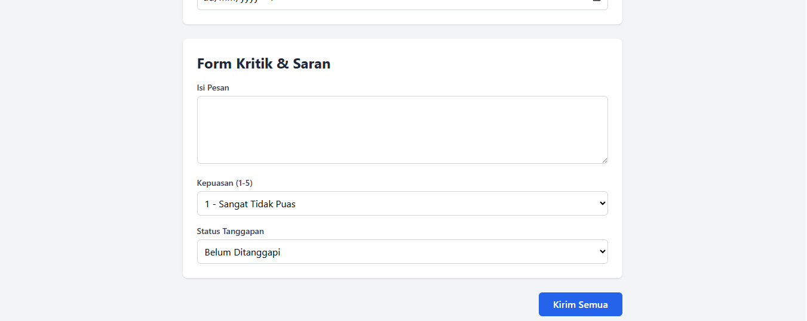
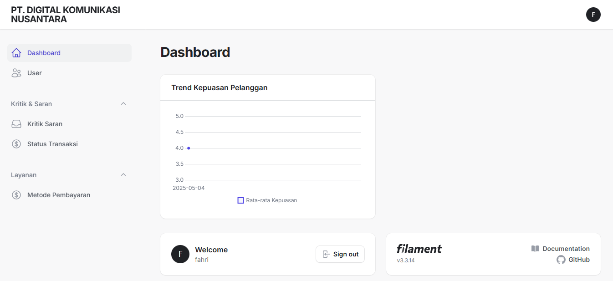
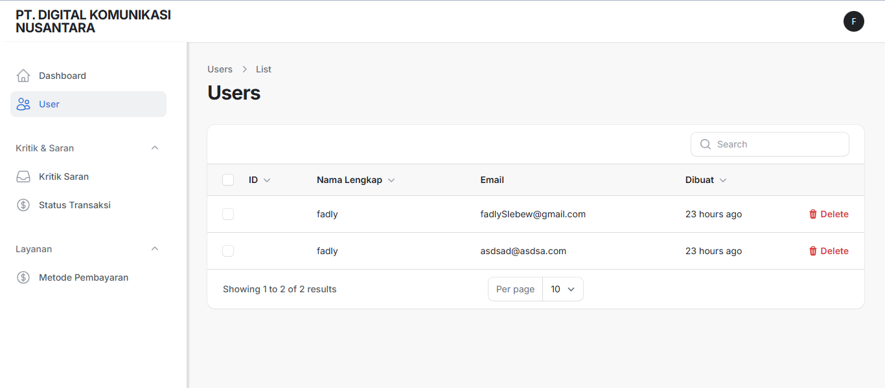
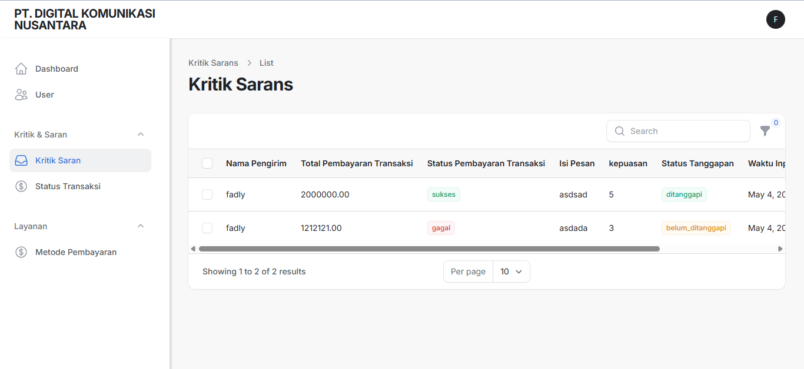
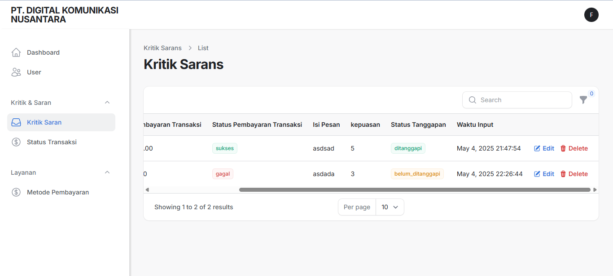
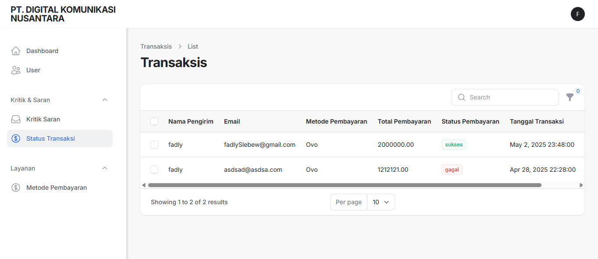
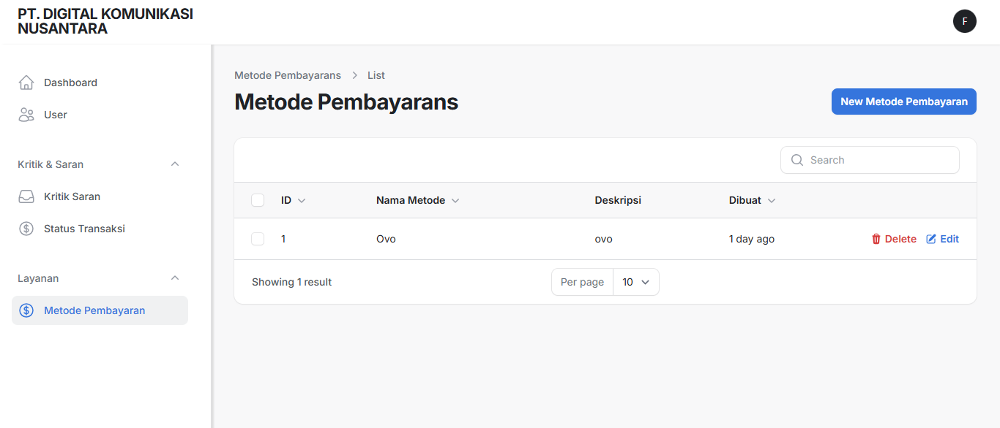
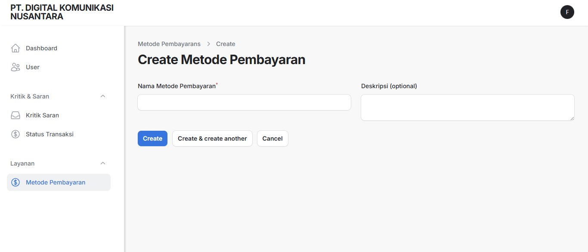

# Website Kritik dan Saran Pembayaran

Proyek ini adalah sebuah aplikasi **Web Feedback** yang memungkinkan pengguna untuk memberikan **kritik dan saran** terkait dengan pembayaran. Website ini dibangun menggunakan **Laravel 11**, **TailwindCSS CDN** untuk bagian frontend (user), dan **Filament** untuk bagian admin panel.

---

## ⚙️ Instalasi & Setup

```bash
# Clone repository
git clone https://github.com/Fahriansyahh/Saran-Masukan.git
cd KRITIK

# Install dependencies
composer install

# Salin file .env.example ke .env dan buat key aplikasi
cp .env.example .env
php artisan key:generate

# Setup Database
php artisan migrate

# Jalankan server
php artisan serve
```

## 📦 Teknologi yang Digunakan

- **Laravel 11** – Framework utama backend
- **MySQL** – Database sistem
- **Filament** – Admin panel dan manajemen data
- **TailwindCSS CDN** – Styling frontend
- **jQuery** – Interaktivitas frontend
- **Laravel Debugbar** – Debugging dan profiling

---

## 🧑‍💻 Fitur

### Pengguna (User):
- Pengguna dapat mengisi form kritik dan saran terkait pembayaran.
- Tampilan form responsif dengan menggunakan **TailwindCSS CDN**.
- Mengirimkan saran atau kritik untuk ditinjau oleh admin.

### Admin:
- Admin dapat melihat dan mengelola kritik dan saran melalui **Filament Admin Panel**.
- Admin dapat menandai saran yang sudah ditanggapi atau diselesaikan.

---

## 📁 Struktur Proyek (Highlight)

- `/app` – Kode utama aplikasi
- `/resources/views` – Blade Templates (Frontend)
- `/public` – Folder untuk akses publik (gambar, assets)
- `/routes/web.php` – Rute aplikasi
- `/database/migrations` – Struktur database

---

## 📸 UI Tampilan

### UI - User
Formulir kritik dan saran dari pengguna.





### UI - Admin
Halaman admin untuk melihat kritik dan saran yang diterima.










---

